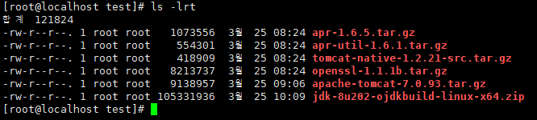
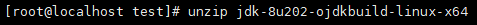
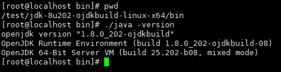
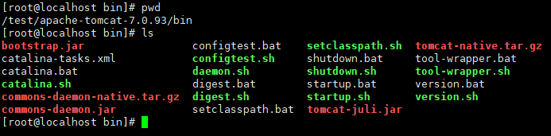
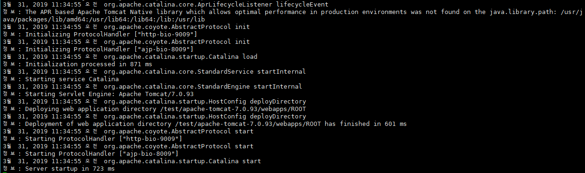
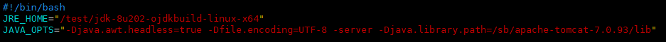
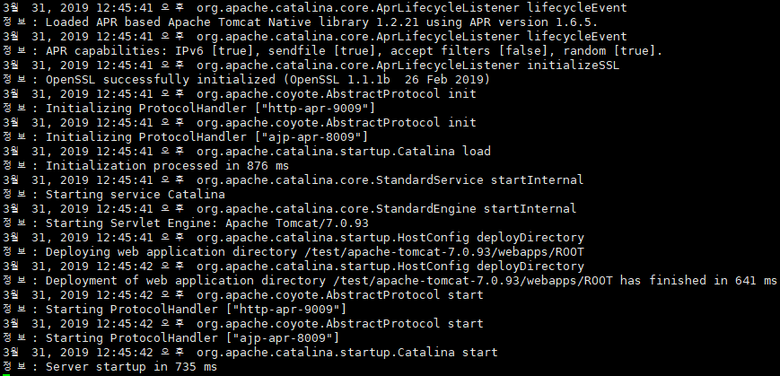

### Tomcat 설치 및 APR 설정

안녕하세요. 오늘은 기록용으로 톰캣 설치 및 APR 을 설정하는 방법에 대해 포스팅 하겠습니다.

	- 설치환경은 리눅스(CentOS Linux 7.5), Tomcat7 기준으로 작성.
	- 2019년 3월 기준 최신버전으로 설치를 진행.
_ _ _

1. 설치 및 설정에 필요한 파일 다운로드

  - tomcat 7 다운로드: https://tomcat.apache.org/download-70.cgi
  - tomcat-native 다운로드: https://tomcat.apache.org/download-native.cgi
  - apr, apr-util 다운로드: https://apr.apache.org/download.cgi
  - openssl 다운로드: https://www.openssl.org/source/
  - openjdk 다운로드: https://github.com/ojdkbuild/ojdkbuild

  

2. 자바 설치 및 실행

  - 리눅스 설치시 자동으로 설치되는 자바를 사용하지 않고 다르게 사용할 경우 진행

  

  

3. 톰캣 설치 및 실행

  ``` $ tar zxvf apache-tomcat-7.0.93.tar.gz ```
  

  ```$ ./startup.sh``` 실행
  

4. APR 설치

  - apr-1.6.5.tar.gz 설치
  ```
  $ mkdir apr
  $ tar zxvf apr-1.6.5.tar.gz
  $ cd apr
  $ ./configure --prefix=/test/apr
  $ make && make install
  ```
  - apr-util-1.6.1.tar.gz 설치
  ```
  $ mkdir apr-util
  $ tar zxvf apr-util-1.6.1.tar.gz
  $ cd apr-util-1.6.1
  $ ./configure --prefix=/test/apr-util --with-apr=/test/apr/bin/apr-1-config
  $ make && make install
  ```
  - openssl-1.1.1b.tar.gz 설치
  ```
  $ mkdir openssl
  $ tar zxvf openssl-1.1.1b.tar.gz
  $ cd openssl
  $ ./config --prefix=/test/openssl
  $ make && make install
  ```
  - tomcat-native-1.2.21-src.tar.gz 설치
  ```
  $ cp tomcat-native-1.2.21-src.tar.gz /test/apache-tomcat-7.0.93/bin/
  $ tar zxvf tomcat-native-1.2.21-src.tar.gz
  $ cd tomcat-native-1.2.21-src/native/
  $ ./configure \
  --with-java-home=/test/jdk-8u202-ojdkbuild-linux-x64 \
  --with-apr=/test/apr/bin/apr-1-config \
  --with-ssl=/test/openssl \
  --prefix=/test/apache-tomcat-7.0.93
  $ make && make install
  ```

5. APR 설정 적용 및 로그 확인

  - catalina.sh나 setenv.sh 파일에 ` -Djava.library.path=/sb/apache-tomcat-7.0.93/lib` 추가
    
  - 로그 확인
    

  - 3번 항목에 있는 Tomcat 로그와 비교를 해보면 APR 설정이 적용되었는지 알수 있습니다.

#### 참고
https://sarc.io/index.php/tomcat/899-apr-apache-portable-runtime-tomcat-native-library